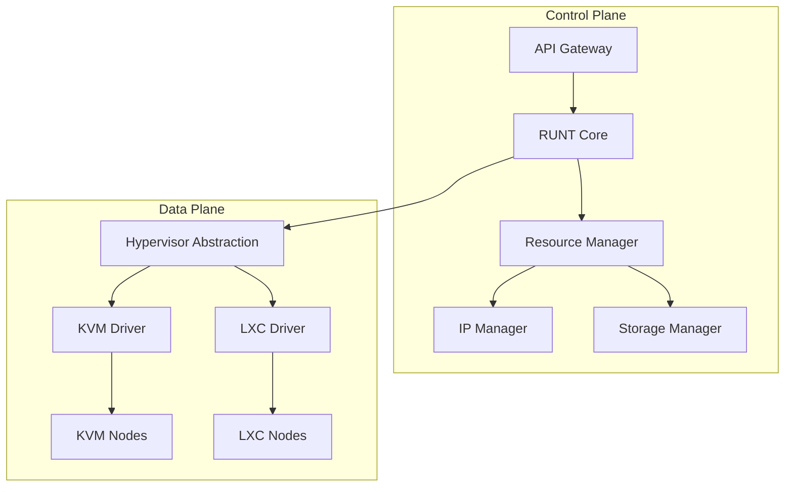
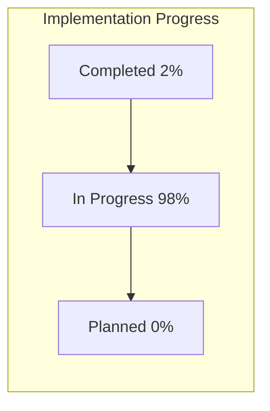
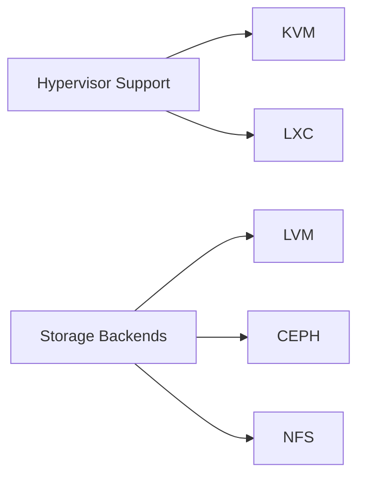
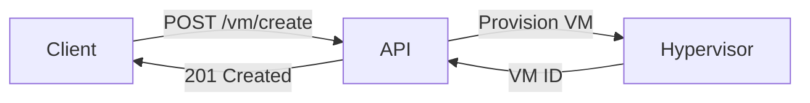

# RUNT V - Ternic Virtualization Management System

## Architecture Overview

```mermaid
flowchart TB
    subgraph Control Plane
        A[API Gateway] --> B[RUNT Core]
        B --> C[Resource Manager]
        C --> D[IP Manager]
        C --> E[Storage Manager]
    end
    
    subgraph Data Plane
        B --> F[Hypervisor Abstraction]
        F --> G[KVM Driver]
        F --> H[LXC Driver]
        G --> I[KVM Nodes]
        H --> J[LXC Nodes]
    end
```

# Implementation Progress

```mermaid
flowchart LR
    subgraph Progress["Implementation Progress"]
        direction TB
        Completed[Completed 2%] --> InProgress[In Progress 98%]
        InProgress --> Planned[Planned 0%]
    end
```

# Technology Support

```mermaid
flowchart LR
    Hypervisors[Hypervisor Support] --> KVM
    Hypervisors --> LXC
    Storage[Storage Backends] --> LVM
    Storage --> CEPH
    Storage --> NFS
```

# API Sequence Flow

```mermaid
flowchart LR
    Client -->|POST /vm/create| API
    API -->|Provision VM| Hypervisor
    Hypervisor -->|VM ID| API
    API -->|201 Created| Client
```