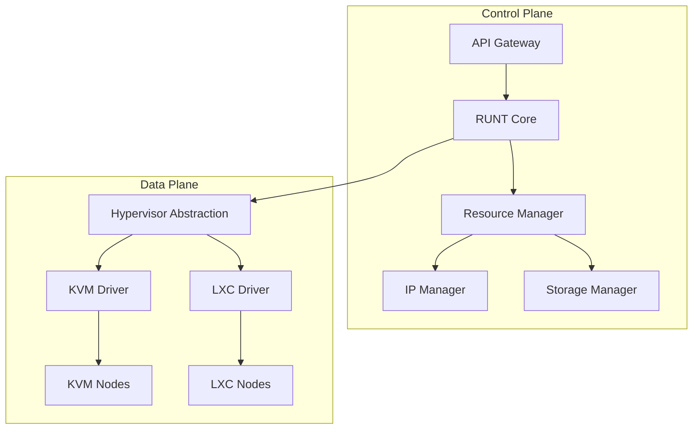

# RUNT V - Ternic Virtualization Management System

## Architecture Overview


```pie
    title Implementation Progress
    "Completed" : 45
    "In Progress" : 30
    "Planned" : 25
```

```mindmap
  root((Requirements))
    Hardware
      x86_64
      VT-x/AMD-v
      Minimum 8GB RAM
    Software
      Linux Kernel 5.15+
      Python 3.10+
      QEMU 6.2+
```

```graph LR
    A[Multi-Hypervisor] --> B((KVM))
    A --> C((LXC))
    D[Storage Backends] --> E((LVM))
    D --> F((CEPH))
    D --> G((NFS))
```

```sequenceDiagram
    participant Client
    participant API
    participant Hypervisor
    Client->>API: POST /vm/create
    API->>Hypervisor: Provision VM
    Hypervisor-->>API: VM ID
    API-->>Client: 201 Created
```